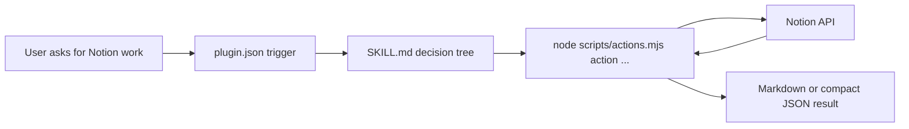

# Architecture

This document explains how `notion-agent-cli` is put together, what it is trying to optimize for, and where the current design is intentionally opinionated.

The short version is:

- the model should work in markdown, not raw Notion block JSON
- common multi-step Notion tasks should collapse into one or two agent turns
- API friction should live in code, not in the model's scratchpad

That sounds simple, but most of the repository follows directly from those three choices.

## What This Project Is

`notion-agent-cli` is a Claude Code plugin backed by a single CLI entry point, [`scripts/actions.mjs`](scripts/actions.mjs). The CLI exposes the actions, ranging from plain reads like `getPage` to workflow-style actions like `copyPageWith`, `mergePages`, and `batchSetProperties`.

The project is not trying to model the full Notion API one-to-one. It is trying to give an LLM a narrower and more useful surface for the kinds of document and workspace work that are common in agent sessions.

That means the architecture is optimized for:

- lower turn count
- smaller tool results
- simpler write payloads
- fewer chances for the model to get lost in Notion API details

It is not optimized for:

- complete API coverage
- minimum code size
- perfect transaction semantics
- being the best interface for every Notion use case

## The Core Idea

The system works by separating two representations:

- **outside the plugin**, the model sees markdown and a small task-oriented command surface
- **inside the plugin**, the code deals with Notion API requests, pagination, conversion, chunking, and retries

That separation matters on both reads and writes.

On reads, a page is returned as markdown rather than a large JSON tree of blocks, annotations, and metadata.

On writes, the model produces markdown rather than constructing raw Notion block payloads itself.

On compound tasks, the model asks for the operation it wants, while the CLI handles the lower-level work needed to produce it.

## Runtime Path

At runtime, a normal request moves through four layers:

1. Claude Code decides whether the plugin is relevant by looking at `.claude-plugin/plugin.json`
2. If triggered, Claude loads `skills/notion-agent-cli/SKILL.md`
3. The skill guides the model toward `node ${CLAUDE_PLUGIN_ROOT}/scripts/actions.mjs <action> ...`
4. `scripts/actions.mjs` executes the action, talks to Notion, and prints a compact result

In practice, the skill layer is doing a lot of work. It is the difference between "there is a script somewhere in this repo" and "the model knows which command to run and when."

## A More Concrete View



This is the important architectural boundary: the model interacts with the CLI surface, not directly with the API surface.

## Why The Skill Layer Exists

Custom CLIs are not self-describing in the way many people assume. A model will not reliably infer a bespoke tool from file names alone, especially once there are multiple commands, options, and workflow shortcuts involved.

That is why the plugin uses a three-layer discovery model:

1. **`plugin.json`** decides when the plugin should come into play
2. **`SKILL.md`** gives the model the first useful operational map
3. **`references/`** provide exact signatures, workflows, and API-limit details when needed

This is one of the stronger parts of the repository because it keeps the always-loaded surface small while still making the tool learnable.

It also matters for the benchmark. The evaluation uses prompt-injected skill content to equalize tool knowledge with MCP. That isolates the interface cost from the discovery cost.

## The Module Tree

Since v0.4.0, runtime behavior is split across `scripts/notion/` into four layers:

- `converters/` for markdown/block/table conversions (pure functions)
- `helpers/` for property extraction, ID normalization, and clone utilities
- `actions/` for the `NotionActions` class, assembled from method-bag modules
- `cli/` for the action registry, argv parsing, output formatting, and the `main()` dispatcher

[`scripts/actions.mjs`](scripts/actions.mjs) remains as the CLI entry point and the import surface for tests and benchmarks. It re-exports the curated public API from `scripts/notion/index.mjs` without adding side effects.

The split improved isolation between layers, but the action class is still assembled by mixing in method-bag modules, so cross-action dependencies can still appear.

## The Dispatcher

The CLI is not just a thin `switch` statement. It has to normalize several ways of invoking the tool:

- direct positional args
- option aliases
- snake_case to camelCase action names
- JSON request file mode
- stdin JSON mode for larger payloads

That dispatcher behavior is part of the product, not just a technical detail. It is what allows the skill to recommend a small number of simple patterns without exposing the full internal complexity every time.

The action registry near the bottom of [`scripts/actions.mjs`](scripts/actions.mjs) is the main catalog of what the CLI promises to support.

## The Action Layer

The `NotionActions` class is the real engine of the plugin.

A useful way to think about the actions is to divide them into two groups.

### Endpoint-like actions

These are relatively close to simple Notion operations:

- `getPage`
- `queryDatabase`
- `createPage`
- `appendBlocks`
- `setProperties`

They still add value by converting formats and hiding API constraints, but they are conceptually close to underlying Notion operations.

### Workflow actions

These are where the architecture becomes more opinionated:

- `copyPageWith`
- `mergePages`
- `replaceSection`
- `batchSetProperties`
- `deepCopy`

These methods absorb the orchestration that the model would otherwise have to do itself across multiple turns and multiple API calls.

That distinction is central to the whole repository. The project becomes most useful when it turns a fragile chain of small tool calls into one stable task-level action.

## Markdown As The Working Representation

Markdown is not just a convenience feature here. It is the main context-management strategy.

There are three reasons for that.

### Readability

The model reads prose and structure better in markdown than in raw Notion block JSON.

### Write simplicity

Asking the model to produce markdown is far less error-prone than asking it to produce nested Notion block payloads with the right shape, length limits, and positioning rules.

### Context size

Compact markdown results are cheaper to carry forward through later turns than raw API objects.

This does not make markdown universally superior. It makes it superior for the kinds of document-oriented agent tasks this plugin is targeting.

## What The Plugin Hides From The Model

Several pieces of operational friction are intentionally pushed into the CLI:

- rate limiting
- pagination
- block chunking
- rich text chunking
- output shaping
- follow-up append behavior

This is a large part of the value proposition.

A good architectural test for any method in this repo is:

> is this something the model should reason about, or something the code should absorb?

In this repository, the answer is usually "the code should absorb it."

## Safety Model

The repository uses the word "safety" often enough that it needs a clear definition.

The current system provides **best-effort content safety**, not full transactional safety.

What it does reasonably well:

- snapshots page content before many destructive content edits
- keeps rollback behavior inside the tool instead of expecting the model to improvise it
- exposes a small set of explicit safety actions such as `snapshot`, `restore`, and `transact`

What it does not guarantee:

- full property rollback across every mutation
- cleanup of every page created during every failed multi-step action
- database-style ACID semantics across arbitrary sequences of Notion operations

This is why the public docs should talk about safety carefully. The system is safer than "let the model wing it," but it is not a formally strong transaction layer.

## Hooks And Setup Validation

`hooks/check-setup.sh` runs on session start and checks whether the environment is sane enough for the plugin to be useful.

The hook validates:

- that dependencies are installed
- that a Notion token is available

That may sound minor, but it improves the first-session experience significantly. Without it, the first interaction is often a confusing runtime failure.

This is a good example of the repository's general posture: move predictable friction out of the model's path.

## Tests

The test suite is split into two broad groups:

- `tests/unit/` covers helpers, conversion behavior, and CLI registry-level behavior
- `tests/property/` checks invariants such as chunking, structural transformations, and normalization

The test suite is useful, especially around converter and dispatcher logic, but it is important to understand what it does not cover. It is not a full end-to-end integration harness against a live Notion workspace.

That gap matters because some of the hardest failures in this repository are integration failures:

- API-version drift
- data source versus database differences
- compound-action rollback edge cases

So the tests provide confidence, but not the whole confidence story.

## Benchmark Harness

The benchmark exists because the project makes an interface claim: a task-level CLI can be cheaper than an endpoint-level tool surface for certain Notion workloads.

Architecturally, the benchmark is not part of the runtime product. It is supporting infrastructure. But it still belongs in the repo because it is part of the argument.

The runner under `benchmark/` does four important things:

- isolates NAC and MCP in separate Claude homes
- resets shared fixtures before each session
- stores full transcripts and summaries
- runs contamination and behavior analysis after the sessions

The harness serves as both an audit trail and a correctness gate. Validation runs automatically after each session, and the results feed into the summary and analysis pipeline.

## Where This Design Is Strong

The current architecture is strongest in five places:

- it gives the model a smaller and more legible working representation
- it uses the skill layer well instead of assuming a custom CLI is self-evident
- it turns several multi-step workflows into stable task-level actions
- it keeps packaging simple
- it preserves benchmark artifacts rather than making unsupported claims

## Where This Design Is Fragile

It is also worth being explicit about the weak points.

### Module tree

The v0.4.0 split moved runtime behavior from one large file into `scripts/notion/` with separate layers for converters, helpers, actions, and CLI dispatch. `scripts/actions.mjs` remains as the CLI entry point and import surface. The split reduced coupling, but the action class is still assembled from method-bag modules, so cross-action dependencies can still appear.

### API churn

Notion's API evolves, especially around databases and data sources. A representation-heavy CLI like this has more surface area to keep aligned.

### Safety overstatement risk

The code does some rollback-related work, but it is easy for docs to accidentally sound stronger than the implementation.

### Benchmark interpretation

The benchmark tells you something useful, but only within a local, prompt-injected, interface-comparison setting. It is not a universal judgment on all forms of MCP.

## Repository Map

```text
notion-agent-cli/
├── .claude-plugin/
│   └── plugin.json
├── hooks/
│   ├── hooks.json
│   └── check-setup.sh
├── scripts/
│   ├── actions.mjs
│   ├── setup.mjs
│   └── notion/
│       ├── index.mjs
│       ├── converters/
│       ├── helpers/
│       ├── actions/
│       └── cli/
├── skills/
│   └── notion-agent-cli/
│       ├── SKILL.md
│       └── references/
├── benchmark/
│   ├── run.py
│   ├── fixture-reset.mjs
│   ├── validate-session.mjs
│   ├── analyze-behavior.mjs
│   ├── parse-sessions.mjs
│   ├── analysis.ipynb
│   └── BENCHMARK.md
├── tests/
│   ├── property/
│   └── unit/
├── README.md
├── ARCHITECTURE.md
└── EVALUATION.md
```

## Closing View

The right way to read this repository is not "a complete Notion platform" and not "an anti-MCP manifesto."

It is a focused interface experiment with a usable implementation behind it:

- markdown as the agent-facing representation
- task-level actions instead of endpoint-level primitives
- code absorbing API friction that the model should not have to reason about

That makes the architecture narrower than a general integration layer, but also more coherent. The repository works best when it stays honest about that.
