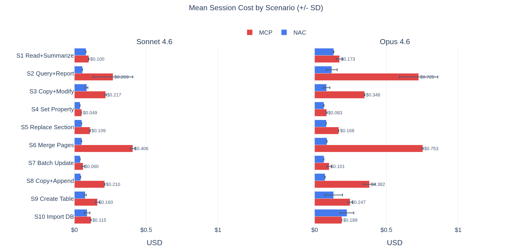
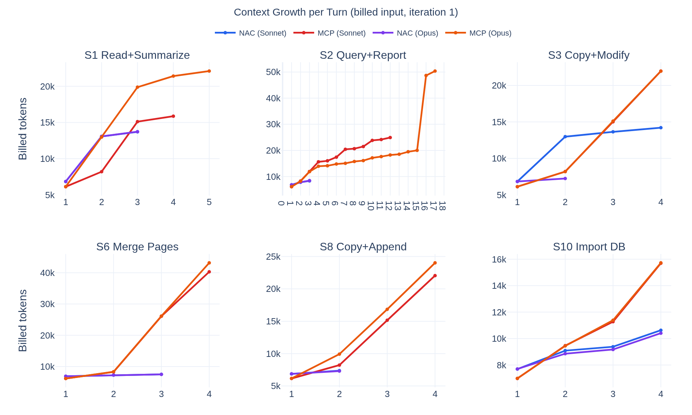

# Evaluation: Why Task-Level Interfaces Reduce Agent Cost

This evaluation is about agent interface design, not just Notion.

The central claim is simple: when an agent has to operate too close to a raw API, it spends extra turns planning, extra tokens carrying verbose tool output forward, and extra effort reconstructing workflows that should have been expressed as one action. In this repository, Notion is the case study used to test that claim.

We compared two interface shapes:

- the official Notion MCP path, which exposes endpoint-level tools and raw JSON
- `notion-agent-cli` (NAC), which exposes task-level actions and returns markdown by default

Across 200 valid benchmark sessions (10 scenarios, 2 models, 2 conditions, 5 iterations each), NAC reduced mean turns from 6.5 to 2.8 and total reported cost from $24.31 to $8.33, roughly a 66% reduction. The gain was largest on compound tasks such as “query and report” and “merge multiple pages.”

These results should be read as directional evidence about interface shape. They are not a final scientific claim, and they do not yet amount to a publication-grade correctness proof.

## Why This Matters

Most discussion about agent tooling starts from transport and interoperability: MCP, plugins, tool schemas, JSON contracts. Those matter, but they are not the whole story.

The more immediate question is often simpler:

> What abstraction level is the model being forced to think in?

If the model has to assemble low-level payloads, paginate through bulky responses, and manually coordinate multi-step workflows, the cost of the session goes up even if the underlying API is fast. The problem is not only latency. It is decision count, context growth, and replayed tool output.

That is why this benchmark matters beyond Notion. Notion happens to make the problem visible because it combines nested document structure, verbose payloads, read-modify-write loops, and common compound tasks. But the underlying lesson is broader: interface shape changes agent behavior.

## The Notion Case Study

Notion is a useful testbed because it exposes a pattern that shows up in many agent systems:

- reads can be structurally noisy
- writes often require precise multi-step transformations
- compound tasks are common
- low-level tool calls compose poorly when the model has to do the orchestration

In practice, that means the same user intent can be expressed in two very different ways.

Under an endpoint-level interface, a task like “query a database and write a report” can become a chain of low-level fetches, transformations, and write calls. Under a task-level interface, the same task can often collapse into something closer to `queryDatabase -> createPage`.

The benchmark asks whether that reduction in abstraction overhead shows up in turns and cost.

## Headline Result

The short answer is yes.

| Model | NAC avg turns | MCP avg turns | NAC total cost | MCP total cost | Saving |
|---|---:|---:|---:|---:|---:|
| Sonnet 4.6 | 2.6 | 5.5 | $3.03 | $8.47 | 64% |
| Opus 4.6 | 2.9 | 7.4 | $5.30 | $15.84 | 67% |

Across both models together:

- mean turns fell from 6.5 to 2.8
- total reported cost fell from $24.31 to $8.33
- the largest savings appeared in the most composition-heavy tasks

The strongest wins appeared when the model would otherwise have to coordinate several low-level operations. The two clearest examples were:

- `Query+Report`
- `Merge Pages`

The interface advantage depends not only on what actions exist, but also on whether the model selects the intended higher-level path. The `Copy+Modify` scenario illustrates this: the NAC advantage there depends on the model picking the compound action rather than falling back to a manual sequence.

*Figure 1. Mean session cost by scenario across Sonnet 4.6 and Opus 4.6. Error bars show mean +/- 1 SD over 5 runs per condition. The widest gaps appear when the MCP path forces the model into longer, lower-level workflows.*

## Why The Gap Appears

Three mechanisms appear to drive most of the difference.

### 1. Fewer turns

Task-level actions compress workflows.

Instead of asking the model to discover and coordinate each step itself, the interface gives it a smaller number of meaningful verbs. That matters because every extra turn replays more of the conversation. Cost is not just about the current step; it is about the growing history that has to be carried into later steps.

### 2. Less context drag

NAC returns markdown by default. MCP returns raw Notion JSON.

That difference is not just aesthetic. It changes how much bulky structure gets pulled into later turns. Smaller, more legible tool output keeps the working context lighter and reduces the amount of material the model has to mentally reparse.

*Figure 2. Cumulative billed input tokens across representative scenarios. The MCP condition becomes more expensive not only because it uses more turns, but because later turns must replay increasingly large contexts.*

### 3. Better alignment between task and tool

The advantage grows with structural complexity.

On simple tasks, a low-level interface is often merely inconvenient. On compound tasks, it becomes expensive. The benchmark showed the biggest gains when the model needed to compose multiple reads and writes, preserve structure, or batch operations. In those cases, the difference between “API endpoints” and “task-level verbs” becomes material.

## Where The Advantage Weakens

The benchmark did not show a uniform win in every case.

A higher-level interface does not automatically guarantee a cheaper session. The model still has to choose the right action and stay on the intended path. Interface design and action selection remain coupled variables.

That is visible in the workflow analysis:

- Sonnet NAC matched the intended workflow in 98% of sessions
- Opus NAC matched it in 100% of sessions

Workflow adherence was 98% for Sonnet NAC and 100% for Opus NAC across the March 28 runs.

S9/S10 (table and database creation scenarios) show a smaller NAC advantage because those tasks are less composition-heavy. When the MCP path only needs a few calls anyway, the gap narrows.

So the lesson is not “higher-level is always better.” The lesson is narrower and more defensible: when the higher-level path is both available and selected, it usually reduces the amount of reasoning and context replay the agent has to pay for.

## What Was Actually Measured

This repository benchmarked the two interfaces under shared conditions:

- the same Notion workspace
- the same prompts
- the same fixtures
- a fixture reset before every run
- 10 scenarios spanning simple and compound agent work
- 5 iterations per scenario, per condition, per model

That produced 200 valid sessions in the final comparison.

The benchmark was designed to compare interface efficiency, not tool discovery. MCP tool schemas are surfaced by the framework. To make the NAC condition comparable, the benchmark injected the contents of `SKILL.md` directly into the prompt. That equalized tool knowledge and made the comparison answer a narrower question:

> Once the model already knows how to use the interface, how expensive is that interface?

This is an important constraint on interpretation. The benchmark does not describe a natural first-contact session.

Validation runs automatically after each session via `validate-session.mjs`, using `NotionActions` directly. The March 28 runs achieved 100% pass rate across all 200 sessions. Validation is still coarse for some scenarios (checking structural shape rather than exact content).

Detailed fixtures, scenario definitions, runner commands, and reproduction steps are documented in [benchmark/BENCHMARK.md](benchmark/BENCHMARK.md).

## Limits

Several limits constrain how broadly these results should be interpreted.

- The NAC condition is prompt-injected, so the benchmark removes the normal discovery tax.
- Validation is automatic but coarse in some scenarios (structural checks, not exact content matching).
- The fixtures come from a single workspace and are moderate in scale.
- The sample is n=5 per scenario and condition. 95% confidence intervals are reported, and effect sizes (Cohen's d) are large across most scenarios, but n=5 precludes formal significance testing.
- S9/S10 show a smaller NAC advantage because table/database creation is less composition-heavy.
- Each model comparison is based on one main run pair rather than repeated runs across multiple days.

So the current evidence is strong enough to support the design claim, but not strong enough to support sweeping universal conclusions.

## Reproducibility

The repository stores the benchmark artifacts, including session summaries, transcripts, environment metadata, contamination checks, and NAC behavior analysis.

If you want to understand how the benchmark was run, start with [benchmark/BENCHMARK.md](benchmark/BENCHMARK.md). If you want to inspect the analysis workflow directly, use [benchmark/analysis.ipynb](benchmark/analysis.ipynb).

This document is intentionally narrower. It focuses on what the benchmark means, while the benchmark guide and notebook cover how to reproduce and inspect it in detail.
